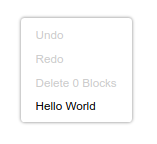

# Customizing your context menus

# 3. Add a context menu option to the workspace

In this section you will create a very basic `Blockly.ContextMenuRegistry.RegistryItem`, then register it to display when you right-click on the workspace.

## The RegistryItem

Blockly stores context menu options as items in a registry. When the user right-clicks, Blockly queries the registry for a list of context menu options that should be displayed.

Each item in the registry has several properties:

- `callback`: A function called when the menu option is selected.
- `scopeType`: An enum indicating when this option should be shown.
- `displayText`: The text to show in the menu. Either a string, or HTML, or a function that returns either of the former.
- `preconditionFn`: Function that returns one of `'enabled'`, `'disabled'`, or `'hidden'` to determine whether and how the menu option should be rendered.
- `weight`: A number that determines the sort order of the option. Options with higher weights appear later in the context menu.
- `id`: A unique string id for the item.

We will discuss these in detail in later sections of the codelab.

## Make a RegistryItem

Add a function to `index.js` named `registerFirstContextMenuOptions`. Create a new registry item in your function:

```js
function registerFirstContextMenuOptions() {
    const workspaceItem = {
      displayText: 'Hello World',
      preconditionFn: function(scope) {
        return 'enabled';
      },
      callback: function(scope) {
      },
      scopeType: Blockly.ContextMenuRegistry.ScopeType.WORKSPACE,
      id: 'hello_world',
      weight: 100,
    };
}
```

Call your function from `start`:

```js
function start() {
  registerFirstContextMenuOptions();
  // Create main workspace.
  workspace = Blockly.inject('blocklyDiv',
    {
      toolbox: toolboxSimple,
    });
}
```

## Register it

Next, register your item with Blockly:

```js
function registerFirstContextMenuOptions() {
  const workspaceItem = {
    // ...
  };
  Blockly.ContextMenuRegistry.registry.register(workspaceItem);
}
```

Note: you will never need to make a new `ContextMenuRegistry`. Always use the singleton `Blockly.ContextMenuRegistry.registry`.

## Test it

Reload your web page and right-click on the workspace. You should see a new item labeled "Hello World" at the bottom of the context menu.

