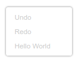

# Customizing your context menus

# 5. Precondition
Each registry item has a `preconditionFn`. This function takes in a scope and returns a string indicating whether and how to display the context menu option. We will discuss the scope in the next section.

## Return value

The return value should be one of `'enabled'`, `'disabled'`, or `'hidden'`.

An **enabled** option is shown with black text and is clickable. A **disabled** option is shown with grey text and is not clickable. A **hidden** option is not included in the context menu at all.

For instance, let's disable `workspaceItem` for the second half of every minute:

```js
preconditionFn: function(scope) {
  const now = new Date(Date.now());
  if (now.getSeconds() < 30) {
    return 'enabled';
  }
  return 'disabled';
}
```

## Test it

Reload your workspace, grab a stopwatch, and right-click to confirm the timing. The item will always be in the menu, but will sometimes be greyed out.

