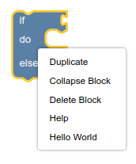

# Customizing your context menus

# 4. Scope type

Every context menu option is registered with a **scope type**, which is either
`Blockly.ContextMenuRegistry.ScopeType.BLOCK`, or
`Blockly.ContextMenuRegistry.ScopeType.COMMENT`, or
`Blockly.ContextMenuRegistry.ScopeType.WORKSPACE.` 

The scope type determines:

- Where the option should be show.
- What information is passed to the precondition and callback functions.

## Add to block scope

You registered your context menu option on the workspace scope but not the block scope. As a result, you will see it when you right-click on the workspace but not when you right-click on a block.

If you want your option to be shown for both workspaces and blocks, you must register it once for each scope type. Add code to `registerFirstContextMenuOptions` to copy and re-register the workspace item:

```js
let blockItem = {...workspaceItem}
blockItem.scopeType = Blockly.ContextMenuRegistry.ScopeType.BLOCK;
blockItem.id = 'hello_world_block';
Blockly.ContextMenuRegistry.registry.register(blockItem);
```

Notice that this code uses the JavaScript spread operator to copy the original item object, then replaces the scope type and id. Simply updating `workspaceItem` and re-registering it would modify the original registry item in place, leading to unintended behaviour.

## Test it

Drag a block into the workspace and right-click it. You should see a "Hello world" option on the block context menu.

