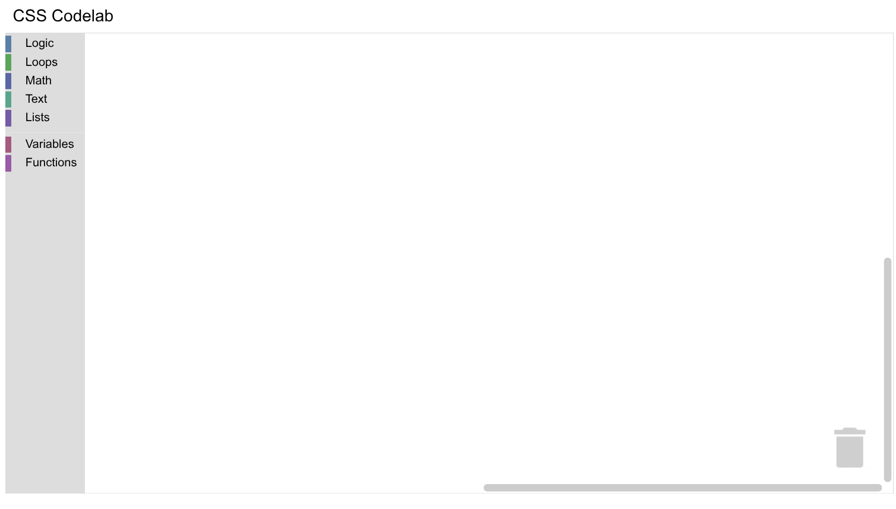
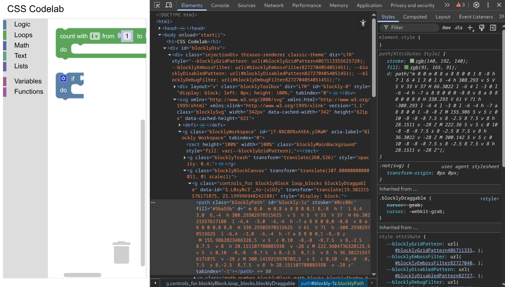

# Use CSS in Blockly

## 1. Codelab overview

### What you'll learn

In this codelab you will learn how to use CSS to customize the colours of:

- Components
- Categories
- Blocks

### What you'll build

A simple Blockly workspace that uses the same Halloween colours as the [Customizing your themes](/blockly/codelabs/theme-extension-identifier/codelab-overview/index.html) codelab.

### What you'll need

- A browser
- Basic knowledge of HTML, CSS, and JavaScript.
- Basic knowledge of your browser's developer tools.
- Basic understanding of Blockly, including workspace components, category toolboxes, block definitions, and themes.

This codelab is focused on using CSS with Blockly. Non-relevant concepts are glossed over and provided for you to simply copy and paste.

## Setup

### Download the sample code

You can get the sample code for this code by either downloading the zip here:

[Download zip](https://github.com/RaspberryPiFoundation/blockly-samples/archive/master.zip)

or by cloning this git repo:

```bash
git clone https://github.com/RaspberryPiFoundation/blockly-samples.git
```

If you downloaded the source as a zip, unpacking it should give you a root folder named `blockly-samples-master`.

The relevant files are in `examples/css-codelab`. There are two versions of the app:

- `starter-code/`: The starter code that you'll build upon in this codelab.
- `complete-code/`: The code after completing the codelab, in case you get lost or want to compare to your version.

Each folder contains:

- `index.html` - A web page containing a simple Blockly workspace.
- `toolbox.js` - A toolbox with multiple categories.
- `index.js` - Code to inject a simple workspace.

The `complete-code` folder also contains the `halloween.css` file you'll create.

To run the code, simply open `starter-code/index.html` in a browser. You should see a Blockly workspace with multiple categories.



## A tour of Blockly's elements

In this section, you'll explore the HTML and SVG elements used by Blockly, as well as the classes assigned to these elements.

In your Blockly editor, drag a `count with` block from the **Loops** category and an `if do` block from the **Logic** category onto your workspace and open your browser's [developer tools](https://developer.mozilla.org/en-US/docs/Learn_web_development/Howto/Tools_and_setup/What_are_browser_developer_tools). Your screen should look something like this:



Using the element inspector, explore the elements used by Blockly. For example, see if you can find the SVG `<path>` element used to draw the `count with` block. If you're having trouble finding things, the following outline might help. (Note that it omits some elements and most attributes.)

```
Description                      DOM elements
-------------------------------  ----------------------------------------------
<body> element                   <body>
  App-specific container           <div id="blocklyDiv">
    Injection element                <div class="injectionDiv">
      Toolbox                          <div class="blocklyToolbox">
      Main SVG element                 <svg class="blocklySvg">
        Main workspace                   <g class="blocklyWorkspace">
          Trash                            <g class="blocklyTrash">
          Block canvas                     <g class="blocklyBlockCanvas">
            Block 1                          <g class="controls_for">
              <path> element                   <path class="blocklyPath">
              Child block 1                    <g class="math_number">
              Child block 2                    <g class="math_number">
              ...                              ...
              Field 1                          <g class="blocklyLabelField">
              Field 2                          <g class="blocklyDropdownField">
              ...                              ...
            Block 2                          <g class="controls_if">
          Bubble canvas                    <g class="blocklyBubbleCanvas">
          Scrollbar background             <rect class="blocklyScrollbarBackground">
      Scrollbars, flyouts, etc.        <svg>s
  Widget, dropdown, tooltip divs   <div>s
```

One thing that's important to notice are the `blocklyXxxx` classes assigned to most elements. These explain how Blockly uses each element and will be the targets of many of your CSS rules. If you look closely, you'll notice that many elements have multiple classes -- for example, the `<g>` element for the dropdown field in the `counts with` block has `blocklyField`, `blocklyDropdownField`, `blocklyVariableField`, and `blocklyEditableField` classes. Having multiple classes allows you to write CSS rules that affect different ranges of elements.
